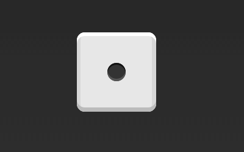

# Flex 布局教程：实例篇

介绍了Flex布局的语法，今天介绍常见布局的Flex写法.

不管是什么布局，Flex往往都可以几行命令搞定。

我只列出代码，详细的语法解释请查阅《[Flex布局教程：语法篇](./Flex-布局教程-语法篇.md)》。

## 1.骰子的布局
骰子的一面，最多可以放置9个点。

下面，就来看看Flex如何实现，从1个点到9个点的布局。你可以到[codepen](https://codepen.io/LandonSchropp/pen/KpzzGo)查看Demo。

如果不加说明，本节的HTML模板一律如下。

    

      
    

上面代码中，div元素（代表骰子的一个面）是Flex容器，span元素（代表一个点）是Flex项目。如果有多个项目，就要添加多个span元素，以此类推。

### 1.1 单项目
首先，只有左上角1个点的情况。Flex布局默认就是首行左对齐，所以一行代码就够了。

    .box {
      display: flex;
    }

设置项目的对齐方式，就能实现居中对齐和右对齐。

    .box {
      display: flex;
      justify-content: center;
    }

    .box {
      display: flex;
      justify-content: flex-end;
    }

设置交叉轴对齐方式，可以垂直移动主轴。

    .box {
      display: flex;
      align-items: center;
    }

    .box {
      display: flex;
      justify-content: center;
      align-items: center;
    }

    .box {
      display: flex;
      justify-content: center;
      align-items: flex-end;
    }

    .box {
      display: flex;
      justify-content: flex-end;
      align-items: flex-end;
    }

### 1.2 双项目

    .box {
      display: flex;
      justify-content: space-between;
    }

    .box {
      display: flex;
      flex-direction: column;
      justify-content: space-between;
    }

    .box {
      display: flex;
      flex-direction: column;
      justify-content: space-between;
      align-items: center;
    }

    .box {
      display: flex;
      flex-direction: column;
      justify-content: space-between;
      align-items: flex-end;
    }

    .box {
      display: flex;
    }

    .item:nth-child(2) {
      align-self: center;
    }

    .box {
      display: flex;
      justify-content: space-between;
    }

    .item:nth-child(2) {
      align-self: flex-end;
    }

### 1.3 三项目

    .box {
      display: flex;
    }

    .item:nth-child(2) {
      align-self: center;
    }

    .item:nth-child(3) {
      align-self: flex-end;
    }

### 1.4 四项目

    .box {
      display: flex;
      flex-wrap: wrap;
      justify-content: flex-end;
      align-content: space-between;
    }

HTML代码如下。

    

      

        1
        2
      

      

        3
        4
      

    

CSS代码如下。

    .box {
      display: flex;
      flex-wrap: wrap; // column 换行
      align-content: space-between;
    }

    .column {
      flex-basis: 100%;
      display: flex;
      justify-content: space-between;
    }

### 1.5 六项目

HTML代码：

    

      

        1
        2
        3
      

      

        4
        5
        6
      

    

CSS代码如下。

    .box {
      display: flex;
      flex-wrap: wrap; // column 换行
      align-content: space-between;
    }

    .column {
      flex-basis: 100%;
      display: flex;
      justify-content: space-between;
    }

HTML:

    

      

        1
        2
        3
      

      

        4
        5
        6
      

    

CSS:

    .box {
      display: flex;
    	justify-content: space-between;
    }

    .column {
      display: flex;
    	flex-direction: column;
      justify-content: space-between;
    }

HTML:

    

      

        
        
        
      

      

        
      

      

       
       
      

    

CSS:

    .box {
      display: flex;
      flex-wrap: wrap;
    }

    .row{
      flex-basis: 100%;
      display:flex;
    }

    .row:nth-child(2){
      justify-content: center;
    }

    .row:nth-child(3){
      justify-content: space-between;
    }

### 1.6 九项目

HTML:

    

        1
        2
        3  
        4
        5
        6  
        7
        8
        9
    

CSS:

    .box {
      display: flex;
      flex-wrap: wrap;
    	justify-content: space-between;
      align-items: center;
    }

## 参考资料
- [Flex 布局教程：实例篇](http://www.ruanyifeng.com/blog/2015/07/flex-examples.html)
