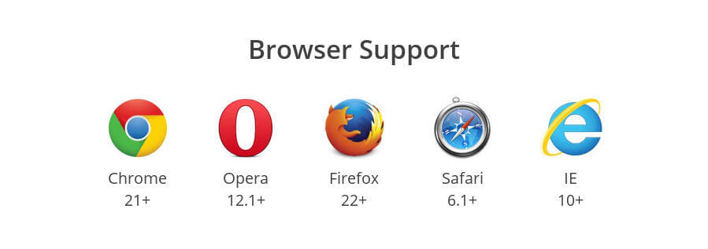

# Flex 布局教程：语法篇

## CSS 布局

### CSS 布局
网页布局（layout）是 CSS 的一个重点应用。

 CSS 布局模式，有时简称为布局，是一种基于盒子与其兄弟和祖辈盒子的交互方式来确定盒子的位置和大小的算法。有以下几种形式：

- 块布局：用来布置文件。块布局包含以文档为中心的功能，例如 [浮动](https://developer.mozilla.org/zh-CN/docs/CSS/float)元素或将其放置在[多列](https://developer.mozilla.org/zh-CN/docs/Web/Guide/CSS/Using_multi-column_layouts)上的功能。
- 行内布局：用来布置文本。
- 表格布局：用来布置表格。
- 定位布局：用来对那些与其他元素无交互的定位元素进行布置 。
- [弹性盒子布局](https://developer.mozilla.org/zh-CN/docs/Web/CSS/CSS_Flexible_Box_Layout/Using_CSS_flexible_boxes)：用来布置那些可以顺利调整大小的复杂页面。
- [网格布局](https://developer.mozilla.org/zh-CN/docs/Web/CSS/CSS_Grid_Layout)：用来布置那些与一个固定网格相关的元素。

块级布局更侧重于垂直方向、行内布局更侧重于水平方向，弹性盒子布局算法是方向无关的。

布局的传统解决方案，基于盒状模型，依赖 [display](https://developer.mozilla.org/zh-CN/docs/Web/CSS/display) 属性 + [position](https://developer.mozilla.org/zh-CN/docs/Web/CSS/position)属性 + [float](https://developer.mozilla.org/zh-CN/docs/CSS/float)属性。它对于那些特殊布局非常不方便，比如，垂直居中就不容易实现。

### 影响CSS布局的属性
  - display
  - margin
  - position + z-index
  - float + clear
  - flex

#### 1. display

 **常用属性值：**
  - none:此元素不会被显示,它和 visibility 属性不一样。把 display 设置成 none 不会保留元素本该显示的空间，但是 visibility: hidden; 还会保留。

  - block:此元素将显示为块级元素，此元素前后会带有换行符。
  - inline:默认。此元素会被显示为内联元素，元素前后没有换行符。
  - inline-block: 行内块元素。
  - list-item: 此元素会作为列表显示。
  - inherit:规定应该从父元素继承 display 属性的值。

  **常见元素默认属性值**

    block:
, 
, <h1> ~ <h6>, <ul>, <form>
    inline:, <a>, <label>, <cite>, <em>
    inline-block:<input>, <textarea>, <select>, <button>

#### 2.margin

  **常用属性值：**
  - auto:浏览器计算外边距。
  - length:规定以具体单位计的外边距值，比如像素、厘米等。默认值是 0px。
  - %:规定基于父元素的宽度的百分比的外边距。
  - inherit: 规定应该从父元素继承外边距。

#### 3. position + z-index

  **常用属性值：**
  - static
  - relative
  - absolute
  - fixed

**属性值解读：**

- position: relative:
    - 相对定位的元素仍在文档流之中，并按照文档流中的顺序进行排列；
    - 参照物为元素本身的位置；
    - "left:20" 会向元素的 LEFT 位置添加 20 像素;
    - 最常用的用途为改变元素层级和设置为绝对定位的参照物；

- position: absolute
    - 建立以包含块为基准的定位，其随即拥有偏移属性和 z-index 属性;
    - 默认宽度为内容宽度;
    - 脱离文档流;
    - 参照物为第一个定位祖先或根元素（<html> 元素）;
    - 元素的位置通过 "left", "top", "right" 以及 "bottom" 属性进行规定。

- position: fixed
    - 默认宽度为内容宽度
    - 脱离文档流  
    - 参照物为视窗
    - 元素的位置通过 "left", "top", "right" 以及 "bottom" 属性进行规定.

**注意：**

 任何元素都可以定位，绝对或固定定位的元素会生成一个块级框，而不论该元素本身是什么类型（相当于自动设置display:block）；

#### z-index（配合定位使用）
z-index 属性设置元素的堆叠顺序。拥有更高堆叠顺序的元素总是会处于堆叠顺序较低的元素的前面。

**取值**
- auto 默认。堆叠顺序与父元素相等；
- number 设置元素的堆叠顺序；
- inherit 规定应该从父元素继承 z-index 属性的值（ie不支持此属性）。

#### 4. float + clear（配合float使用）
float 属性定义元素在哪个方向浮动。浮动仅仅影响文档流中下一个紧邻的元素。

**常见取值**
  - left 元素向左浮动。
  - right 元素向右浮动。
  - none 默认值。元素不浮动，并会显示在其在文本中出现的位置。
  - inherit 规定应该从父元素继承 float 属性的值。

**详细解读**
  - 默认宽度为内容宽度
  - 脱离文档流（会被父元素边界阻挡与position脱离文档流的方式不同）
  - 元素对象设置了float属性之后，它将不再独自占据一行。浮动块可以向左或向右移动，直到它的外边缘碰到包含它的框或另一个浮动块的边框为止。

**注意：**
  - 任何元素都可以设置为浮动，且设置浮动后自动转化为块级框；
  - float 元素是半脱离文档流的，对元素是脱离文档流，但对于内容则是在文档流之中的（既元素重叠但内容不重叠）。示例
  - float 元素在同一文档流中，当同时进行 float 时它们会按照文档流中的顺序排列。(当所有父元素中的所有元素脱离文档流之后，父元素将失去原有默认的内容高度（浮动“塌陷”）)

#### clear
clear 属性规定元素的哪一侧不允许其他浮动元素。

**常见取值**
  - left 不允许出现左浮动元素
  - right 不允许出现右浮动元素
  - both 左右浮动都不允许出现。
  - none 默认值。允许浮动元素出现在两侧。
  - inherit 规定应该从父元素继承 clear 属性的值。

**使用方法：**

优先级自上而下
  - clearfix 于父元素；
  - 浮动后续空白元素 .emptyDiv {clear: both}；
  - 为受到影响的元素设置 width: 100% overflow: hidden 也可；
  - 块级元素可以使用 ` `但是 不建议使用，影响 HTML 结构；

      /* clearfix */
      .clearfix:after{
          content: ".";
          visibility: hidden;
          display: block;/*设置display：block是为了之后能设置高度*/
          height: 0;
          clear: both;
      }
      .clearfix{zoom:1;}/*兼容ie*/

#### 5.flex 弹性布局
相见下面介绍。

# 弹性（ Flex ）布局

## 1. Flex 布局是什么？

2009年，W3C 提出了一种新的方案----Flex 布局，可以简便、完整、响应式地实现各种页面布局。目前，它已经得到了所有浏览器的支持，这意味着，现在就能很安全地使用这项功能。

浏览器支持：

Flex 布局将成为未来布局的首选方案。

**[demo地址](Demo)**

Flex 是 `Flexible Box` 的缩写，意为"弹性布局"，用来为盒状模型提供最大的灵活性。

任何一个容器都可以指定为 Flex 布局。

    .box{
      display: flex;
    }

行内元素也可以使用 Flex 布局。

    .box{
      display: inline-flex;
    }

Webkit 内核的浏览器，必须加上`-webkit`前缀。**此部分可以用CSS自动不全插件去实现。**

    .box{
      display: -webkit-flex; /* Safari */
      display: flex;
    }

> 注意，设为 Flex 布局以后，子元素的`float`、`clea`r和`vertical-align`属性将失效。

## 2.基本概念

- 弹性容器(Flex container)  
  包含着弹性项目的父元素。通过设置 `display` 属性的值为 `flex` 或  `inline-flex` 来定义弹性容器。

- 弹性项目(Flex item)
  弹性容器的每个子元素都称为弹性项目。弹性容器直接包含的文本将被包覆成匿名弹性单元。

- 轴(Axis)  
  每个弹性框布局包含两个轴。弹性项目沿其依次排列的那根轴称为`主轴(main axis)`。垂直于主轴的那根轴称为`侧轴(cross axis)`。

  - [flex-direction](https://developer.mozilla.org/zh-CN/docs/Web/CSS/flex-direction) 确立主轴。
  - [justify-content](https://developer.mozilla.org/zh-CN/docs/Web/CSS/justify-content) 定义了在当前行上，弹性项目沿主轴如何排布。
  - [align-items](https://developer.mozilla.org/zh-CN/docs/Web/CSS/align-items) 定义了在当前行上，弹性项目沿侧轴默认如何排布。
  - [align-self](https://developer.mozilla.org/zh-CN/docs/Web/CSS/align-self) 定义了单个弹性项目在侧轴上应当如何对齐，这个定义会覆盖由 align-items 所确立的默认值。

- 方向(Direction)  
  弹性容器的`主轴起点(main start)/主轴终点(main end)`和`侧轴起点(cross start)/侧轴终点(cross end)`描述了弹性项目排布的起点与终点。它们具体取决于弹性容器的主轴与侧轴中，由 `writing-mode` 确立的方向（从左到右、从右到左，等等）。

  - [order](https://developer.mozilla.org/zh-CN/docs/Web/CSS/order) 属性将元素与序号关联起来，以此决定哪些元素先出现。
  - [flex-flow](https://developer.mozilla.org/zh-CN/docs/Web/CSS/flex-flow) 属性是 [flex-direction](https://developer.mozilla.org/zh-CN/docs/Web/CSS/flex-direction) 和 [flex-wrap](https://developer.mozilla.org/zh-CN/docs/Web/CSS/flex-wrap) 属性的简写，决定弹性项目如何排布。

- 行(Line)  
  根据 [flex-wrap](https://developer.mozilla.org/zh-CN/docs/Web/CSS/flex-wrap) 属性，弹性项目可以排布在单个行或者多个行中。此属性控制侧轴的方向和新行排列的方向。

- 尺寸(Dimension)  
  根据弹性容器的主轴与侧轴，弹性项目的宽和高中，对应主轴的称为`主轴尺寸(main size) `，对应侧轴的称为 `侧轴尺寸(cross size)`。

  - min-height 与 min-width 属性初始值将为 0。
  - [flex](https://developer.mozilla.org/zh-CN/docs/Web/CSS/flex) 属性是 [flex-grow](https://developer.mozilla.org/zh-CN/docs/Web/CSS/flex-grow)、[flex-shrink](https://developer.mozilla.org/zh-CN/docs/Web/CSS/flex-shrink) 和 [flex-basis](https://developer.mozilla.org/zh-CN/docs/Web/CSS/flex-basis) 属性的简写，描述弹性项目的整体的伸缩性。

### 3.弹性容器(Flex container)属性
  以下6个属性设置在容器上：

  - flex-direction
  - flex-wrap
  - flex-flow
  - justify-content
  - align-items
  - align-content

#### 3.1 flex-direction属性
`flex-direction`属性决定主轴的方向（即项目的排列方向）。

    .box {
      flex-direction: row | row-reverse | column | column-reverse;
    }

它可能有4个值。
  - row（默认值）：主轴为水平方向，起点在左端。
  - row-reverse：主轴为水平方向，起点在右端。
  - column：主轴为垂直方向，起点在上沿。
  - column-reverse：主轴为垂直方向，起点在下沿。

#### 3.2 flex-wrap属性
默认情况下，项目都排在一条线（又称"轴线"）上。`flex-wrap`属性定义，如果一条轴线排不下，如何换行。

    .box{
      flex-wrap: nowrap | wrap | wrap-reverse;
    }

它可能取三个值:

  - `nowrap`（默认）：不换行。

    

  - `wrap`：换行，第一行在上方。

    

  - `wrap-reverse`：换行，第一行在下方。

    

#### 3.3 flex-flow
  `flex-flow`属性是`flex-direction`属性和`flex-wrap`属性的简写形式，默认值为`row nowrap`。

    .box {
      flex-flow: <flex-direction> || <flex-wrap>;
    }

#### 3.4 justify-content属性

`justify-content`属性定义了项目在主轴上的对齐方式。

    .box {
      justify-content: flex-start | flex-end | center | space-between | space-around;
    }

它可能取5个值，具体对齐方式与轴的方向有关。下面假设主轴为从左到右。

  - flex-start（默认值）：左对齐
  - flex-end：右对齐
  - center： 居中
  - space-between：两端对齐，项目之间的间隔都相等。
  - space-around：每个项目两侧的间隔相等。所以，项目之间的间隔比项目与边框的间隔大一倍。

#### 3.5 align-items属性

`align-items`属性定义项目在交叉轴/侧轴上如何对齐。

    .box {
      align-items: flex-start | flex-end | center | baseline | stretch;
    }

它可能取5个值。具体的对齐方式与交叉轴的方向有关，下面假设交叉轴从上到下。
  - flex-start：交叉轴的起点对齐。
  - flex-end：交叉轴的终点对齐。
  - center：交叉轴的中点对齐。
  - baseline: 项目的第一行文字的基线对齐。
  - stretch（默认值）：如果项目未设置高度或设为auto，将占满整个容器的高度。

#### 3.6 align-content属性
`align-content`属性定义了多根轴线的对齐方式。如果项目只有一根轴线，该属性不起作用。

    .box {
      align-content: flex-start | flex-end | center | space-between | space-around | stretch;
    }
该属性可能取6个值。
  - flex-start：与交叉轴的起点对齐。
  - flex-end：与交叉轴的终点对齐。
  - center：与交叉轴的中点对齐。
  - space-between：与交叉轴两端对齐，轴线之间的间隔平均分布。
  - space-around：每根轴线两侧的间隔都相等。所以，轴线之间的间隔比轴线与边框的间隔大一倍。
  - stretch（默认值）：轴线占满整个交叉轴。

### 4. 弹性项目(Flex item)
以下6个属性设置在项目上。
  - order
  - flex-grow
  - flex-shrink
  - flex-basis
  - flex
  - align-self

#### 4.1 order属性

`order`属性定义项目的排列顺序。数值越小，排列越靠前，默认为0。

    .item {
      order: <integer>;
    }

#### 4.2 flex-grow属性
`flex-grow`属性定义项目的放大比例，默认为`0`，即如果存在剩余空间，也不放大。

    .item {
      flex-grow: <number>; /* default 0 */
    }

如果所有项目的`flex-grow`属性都为1，则它们将等分剩余空间（如果有的话）。如果一个项目的`flex-grow`属性为2，其他项目都为1，则前者占据的剩余空间将比其他项`多一倍`。

#### 4.3 flex-shrink属性
`flex-shrink`属性定义了项目的缩小比例，默认为1，即如果空间不足，该项目将缩小。

    .item {
      flex-shrink: <number>; /* default 1 */
    }

    

如果所有项目的flex-shrink属性都为1，当空间不足时，都将等比例缩小。如果一个项目的flex-shrink属性为0，其他项目都为1，则空间不足时，前者不缩小。

**负值对该属性无效。**

#### 4.4 flex-basis属性
`flex-basis`属性定义了在分配多余空间之前，项目占据的主轴空间（main size）。浏览器根据这个属性，计算主轴是否有多余空间。它的默认值为`auto`，即项目的本来大小。

    .item {
      flex-basis: <length> | auto; /* default auto */
    }

它可以设为跟`width`或`height`属性一样的值（比如350px），则项目将占据固定空间。

#### 4.5 flex属性
`flex`属性是`flex-grow`, `flex-shrink` 和 `flex-basis`的简写，默认值为0 1 auto。后两个属性可选。

    .item {
      flex: none | [ <'flex-grow'> <'flex-shrink'>? || <'flex-basis'> ]
    }

  该属性有两个快捷值：`auto (1 1 auto)` 和 `none (0 0 auto)`。

  **建议优先使用这个属性**，而不是单独写三个分离的属性，因为浏览器会推算相关值。

#### 4.6 align-self属性
`align-self`属性允许单个项目有与其他项目不一样的对齐方式，可覆盖`align-items`属性。默认值为`auto`，表示继承父元素的`align-items`属性，如果没有父元素，则等同于`stretch`。

    .item {
      align-self: auto | flex-start | flex-end | center | baseline | stretch;
    }

该属性可能取6个值，除了auto，其他都与align-items属性完全一致。

## 参考资料
- [布局模式](https://developer.mozilla.org/zh-CN/docs/Web/CSS/Layout_mode)
- [使用CSS的多列布局](https://developer.mozilla.org/zh-CN/docs/Web/Guide/CSS/Using_multi-column_layouts)
- [Flex 布局教程：语法篇](http://www.ruanyifeng.com/blog/2015/07/flex-grammar.html)
- [深入学习CSS布局系列（一）布局常用属性](https://segmentfault.com/a/1190000004640011)
