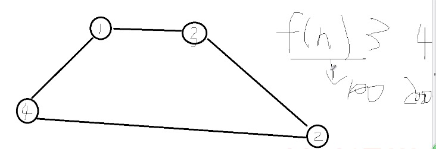
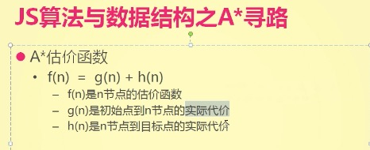
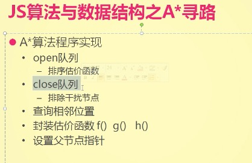

# A*寻路

从 1 走到 2 ，有两条线路：
  - 1 --> 3 --> 2
  - 1 --> 4 --> 2

思路：

    估价函数 f(h),   
    假如 f(3) ==> 100 ; fn(4) ==> 200，
    程序就可以根据 估价函数值 的大小获取到最优的路线。

### 估价函数

### A*算法程序实现

#### 知识点：
- Array.prototype.shift()  
  shift() 方法从数组中删除第一个元素，并返回该元素的值。此方法更改数组的长度。

      let a = [1, 2, 3];
      let b = a.shift();

      console.log(a);
      // [2, 3]

      console.log(b);
      // 1
