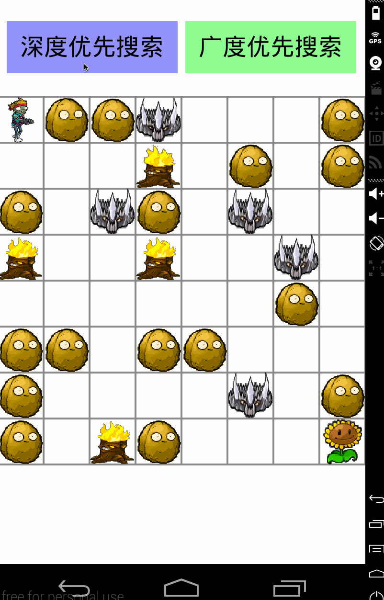
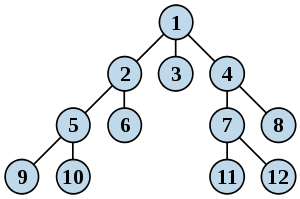

# A*寻路

## 寻路模式
- 深度优先搜索
- 广度优先搜索
- 启发式搜索
  - A* 算法

### [深度优先搜索](https://zh.wikipedia.org/wiki/%E6%B7%B1%E5%BA%A6%E4%BC%98%E5%85%88%E6%90%9C%E7%B4%A2)

深度优先搜索算法（英语：Depth-First-Search，简称DFS）是一种用于遍历或搜索树或图的算法。沿着树的深度遍历树的节点，尽可能深的搜索树的分支。当节点v的所在边都己被探寻过，搜索将回溯到发现节点v的那条边的起始节点。这一过程一直进行到已发现从源节点可达的所有节点为止。如果还存在未被发现的节点，则选择其中一个作为源节点并重复以上过程，整个进程反复进行直到所有节点都被访问为止。属于盲目搜索。

深度优先搜索是图论中的经典算法，利用深度优先搜索算法可以产生目标图的相应拓扑排序表，利用拓扑排序表可以方便的解决很多相关的图论问题，如最大路径问题等等。

因发明“深度优先搜索算法”，約翰·霍普克洛夫特与罗伯特·塔扬共同获得计算机领域的最高奖：图灵奖。

#### 主要思想
主要思想：不撞南墙不回头。

深度优先遍历的主要思想就是：首先以一个未被访问过的顶点作为起始顶点，沿当前顶点的边走到未访问过的顶点；当没有未访问过的顶点时，则回到上一个顶点，继续试探访问别的顶点，直到所有的顶点都被访问。

沿着某条路径遍历直到末端，然后回溯，再沿着另一条进行同样的遍历，直到所有的顶点都被访问过为止。

#### 图解

### [广度优先搜索](https://zh.wikipedia.org/zh-cn/%E5%B9%BF%E5%BA%A6%E4%BC%98%E5%85%88%E6%90%9C%E7%B4%A2)

广度优先搜索算法（英语：Breadth-First-Search，缩写为BFS），又译作宽度优先搜索，或横向优先搜索，是一种图形搜索算法。简单的说，BFS是从根节点开始，沿着树的宽度遍历树的节点。如果所有节点均被访问，则算法中止。广度优先搜索的实现一般采用open-closed表。

#### 作法
BFS是一种盲目搜寻法，目的是系统地展开并检查图中的所有节点，以找寻结果。换句话说，它并不考虑结果的可能位址，彻底地搜索整张图，直到找到结果为止。BFS并不使用经验法则算法。

从算法的观点，所有因为展开节点而得到的子节点都会被加进一个先进先出的队列中。一般的实现里，其邻居节点尚未被检验过的节点会被放置在一个被称为 open 的容器中（例如队列或是链表），而被检验过的节点则被放置在被称为 closed 的容器中。（open-closed表）

#### 图解

## [启发式搜索](https://zh.wikipedia.org/zh-cn/%E5%90%AF%E5%8F%91%E5%BC%8F%E6%90%9C%E7%B4%A2#%E5%95%9F%E7%99%BC%E5%BC%8F%E6%BC%94%E7%AE%97%E6%B3%95)

启发式算法则试图一次提供一个或全部目标。例如它常能发现很不错的解，但也没办法证明它不会得到较坏的解；它通常可在合理时间解出答案，但也没办法知道它是否每次都可以这样的速度求解。

有时候人们会发现在某些特殊情况下，启发式算法会得到很坏的答案或效率极差，然而造成那些特殊情况的数据结构，也许永远不会在现实世界出现。因此现实世界中启发式算法很常用来解决问题。启发式算法处理许多实际问题时通常可以在合理时间内得到不错的答案。

#### 启发式算法与最短路径问题
所谓的[最短路径问题](https://zh.wikipedia.org/wiki/%E6%9C%80%E7%9F%AD%E8%B7%AF%E9%97%AE%E9%A2%98)有很多种意思，在这里启发式指的是一个在一个搜索树的节点上定义的函数 h(n)，用于评估从此节点到目标节点最便宜的路径。启发式通常用于信息充份的搜索算法，例如最好优先[贪婪算法](https://zh.wikipedia.org/wiki/%E8%B4%AA%E5%BF%83%E6%B3%95)与[A*](https://zh.wikipedia.org/wiki/A*%E6%90%9C%E5%AF%BB%E7%AE%97%E6%B3%95)。最好优先贪婪算法会为启发式函数选择最低代价的节点；A* 则会为 g(n) + h(n)选择最低代价的节点，此 g(n)是从起始节点到目前节点的路径的确实代价。如果 h(n)是可接受的（admissible）意即 h(n)未曾付出超过达到目标的代价，则A*一定会找出最佳解。

最能感受到启发式算法好处的经典问题是[n-puzzle](https://zh.wikipedia.org/wiki/%E6%95%B8%E5%AD%97%E6%8E%A8%E7%9B%A4%E9%81%8A%E6%88%B2)。此问题在计算错误的拼图图形，与计算任两块拼图的[曼哈顿距离](https://zh.wikipedia.org/zh-cn/%E6%9B%BC%E5%93%88%E9%A0%93%E8%B7%9D%E9%9B%A2)的总和以及它距离目的有多远时，使用了本算法。注意，上述两条件都必须在可接受的范围内。

- 启发式算法对运算性能的影响

  任何的搜索问题中，每个节点都有 b个选择以及到达目标的深度 d，一个毫无技巧的算法通常都要搜索  bd个节点才能找到答案。启发式算法借由使用某种切割机制降低了分叉率（branching factor）以改进搜索效率，由 bd 降到较低的  b1。分叉率可以用来定义启发式算法的偏序关系，例如：若在一个 n节点的搜索树上， h1(n)的分叉率较 h2(n)低，则 h1(n) < h2(n)。启发式为每个要解决特定问题的搜索树的每个节点提供了较低的分叉率，因此它们拥有较佳效率的计算能力。

- 找寻新的启发式算法

  如何找到一个分叉率较少又通用的合理启发式算法，已被人工智能社区深入探究过。他们使用几种常见技术：
