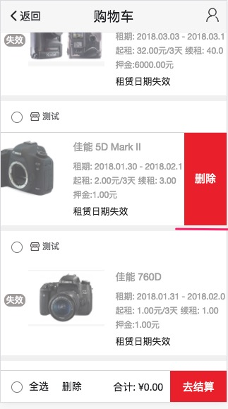
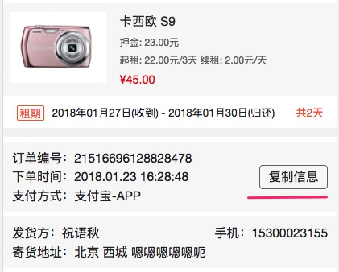
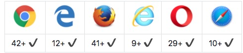
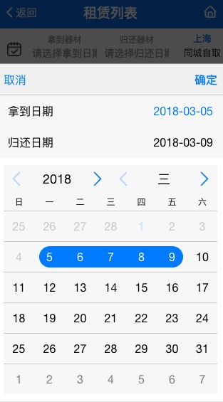

# 移动端项目开发总结（一）

前阵子做租赁项目，风风火火的上线，趁现在还没忘，把用到的东西整理以下，算是对于这个项目的回顾把。

## 特效一 ： 移动端适配
**需求**

移动端适配，采用rem单位。`结合JS和CSS共同`来实现不同屏幕之间的适配。

rem 是相对于 html 元素的 `font-size` 的一个单位。如果 html 上定义了 font-size: 20px;，则无论在任何地方都是 `1rem = 20px` 这个大小不会受到父元素的影响。

我们统一使用rem对页面进行整体缩放。强烈建议大家对需要适应页面大小的任何元素都使用 rem 为单位来定义。

我们在 iphone6 上使用 `1rem = 20px` 来换算。小于 375px 的设备上不做缩小处理，对 大于 375px 宽度的设备进行等比缩放。

**解决方案**

采用**SUI Mobile**框架中的模块。

**SUI Mobile**
- 官网地址： http://m.sui.taobao.org/
- github地址：https://github.com/sdc-alibaba/SUI-Mobile

**安装和使用**

**安装**

  **JS**

    
    

  **对应CSS**

    // 375屏幕为 20px，以此为基础计算出每一种宽度的字体大小
    // 375以下不变，375以上等比放大
    html {
      font-size: 20px;
    }
    @media only screen and (min-width: 400px) {
      html {
        font-size: 21.33333333px !important;
      }
    }
    @media only screen and (min-width: 414px) {
      html {
        font-size: 22.08px !important;
      }
    }
    @media only screen and (min-width: 480px) {
      html {
        font-size: 25.6px !important;
      }
    }

  **device.js** 作用
  - 修改：pixel-ratio的值，用来处理边框等问题。（如果不需要的话可以省掉）

        @media only screen and (-webkit-min-device-pixel-ratio: 2) {
          .list-block .item-inner:after {
            -webkit-transform: scaleY(0.5);
                    transform: scaleY(0.5);
          }
        }
        @media only screen and (-webkit-min-device-pixel-ratio: 3) {
          .list-block .item-inner:after {
            -webkit-transform: scaleY(0.33);
                    transform: scaleY(0.33);
          }
        }

  - 另外一个是判断设备的参数：提供了一些基本的设备侦测信息可供使用。

        console.log($.device)
        // --------
        {
          android: true
          androidChrome: false
          ios: false
          ipad: false
          iphone: false
          isWeixin: false
          os: "android"
          osVersion: "4.4.1"
          pixelRatio: 3
          statusBar: false
          webView: null
        }

  > 使用sublime Text 的 [‘CSSREM’](https://github.com/hyb628/cssrem) 更能提高便写效率。

  **更多参考方案**
  - [移动端页面适配———多方案解析](https://juejin.im/entry/59ca3c6df265da064f2024af)
  - [移动端适配方案(上)](https://github.com/riskers/blog/issues/17)
  - [移动端布局适配方案](http://blog.poetries.top/2017/11/05/mobile-layout/)
  - [移动端开发中，关于适配问题的一点总结(一)](https://www.jianshu.com/p/3a5063028706)

## 特效二 ： 拖动左滑动，显示删除按钮
**需求**

购物车部分新加个滑动显示删除的按钮，可以删除商品。参考微信滑动删除。

直接看下图：

**解决方案**

**1. 使用插件 - swipeout**

[SwipeOut](https://github.com/ankane/swipeout)

**安装使用步骤**

**安装**

SwipeOut 需要依赖Hammer.js，需要把下面两个JS引入到你的项目中：

[Hammer.js](http://hammerjs.github.io/dist/hammer.min.js) and [SwipeOut](https://raw.githubusercontent.com/ankane/swipeout/master/swipeout.js)

> hammerjs 官方地址： http://hammerjs.github.io/

调用展示

    
    

**使用**

**实例化** 在 `<ul>` 或 `<ol>` 标签上 实例化 SwipeOut。

    var list = document.getElementById("list");
    new SwipeOut(list);

如果有多个，重复调用

    function SwipeOutBind(){
        var cartList = document.getElementById("list"),
            cartUl = list.getElementsByTagName('ul');
        for(var i = 0; i < cartUl.length; i++){
            new SwipeOut(cartUl[i],{
                'btnText' : '删除'
            })
        }
    }

**调用JavaScript**

  **原生JS**

    list.addEventListener("delete", function(evt) {
      // do something, like an ajax call to server
      // evt.target references the list item
    });

**jQuery or Zepto**

    $("#list li").on("delete", function(evt) {
      // ...
    });

**定制**

‘删除’按钮默认没有样式，你可以根据自己需要定制以下样式：

    .swipe-out .delete-btn {
      padding: 6px 8px;
      border-radius: 6px;
      border: solid 1px rgb(96,23,18);
      background-image: linear-gradient(top, rgb(242,153,157), rgb(213,62,41));
      background-image: -webkit-linear-gradient(top, rgb(242,153,157), rgb(213,62,41));
      background-image: -moz-linear-gradient(top, rgb(242,153,157), rgb(213,62,41));
      background-image: -o-linear-gradient(top, rgb(242,153,157), rgb(213,62,41));
      text-shadow: 0em -0.1em rgb(51,51,51);
      color: #fff;
      font: bold 14px/20px "Helvetica Neue", Arial, Helvetica, sans-serif;
    }

‘删除’按钮的文案你可以自己修改：

    new SwipeOut(list, {
      btnText: "Remove"
    }); // default: "Delete"

**其他解决方案**

- [js移动端向左滑动出现删除按钮](http://www.cnblogs.com/libin-1/p/6431581.html)
- [写一个js向左滑动删除 交互特效的插件——Html5 touchmove](http://hovertree.com/h/bjaf/g7qrqcp5.htm)

## 特效三 ： 点击复制文本

**需求**

订单部分，实现点击复制的功能。

直接看下图：

**解决方案**

**使用clipboard.js插件**

clipboard.js
- 官网地址：https://clipboardjs.com/
- github地址：https://github.com/zenorocha/clipboard.js/

**安装**

npm

> npm install clipboard --save

CDN link

- jsDelivr

        

- cdnjs

        

- RawGit

        

- unpkg

        

**浏览器支持**

**使用**

  **html**

    

      <ul class="text-list" id="orderInfo">
          <li>订单编号：21516696128828478</li>
          <li>下单时间：2018.01.23 16:28:48</li>
          <li>支付方式：支付宝-APP  </li>
      </ul>
      复制信息
    

  **js**

    // 复制信息
    var clipboard = new Clipboard('.text-list-wrap .copy-button', {
      target: function () {
          return document.querySelector('#orderInfo');
      }
    });
    clipboard.on('success', function (e) {
      //console.log(e.text);
      $.toast('复制成功');
    });

    clipboard.on('error', function (e) {
      //console.log(e.text);
    });

## 特效三 ： 移动端日历选择联动插件
**需求**

需要实现点击选择开始时间和结束时间。并且需要实现某些日期不可选。

具体如下图：

**实现方案**
采用 **mobiscroll**插件实现

**mobiscroll**
- 官网地址：https://mobiscroll.com/
- 中文文档：https://www.mobiscroll.cn/app/mobiscroll/index
- gitHub地址：https://github.com/search?p=2&q=mobiscroll&type=Repositories

**使用**

**加载必须文件**

    
    <link href="css/mobiscroll.javascript.min.css" rel="stylesheet" type="text/css">

**添加HTML标记**

    

        
            拿到器材
            <input id="startDate" type="text" value="" readonly="" placeholder="请选择拿到日期">
        
        共<em></em>天
        
            归还器材
            <input id="endDate" type="text" value="" readonly="" placeholder="请选择归还日期">
         
    

**js**

    mobiscroll.range('#range', {{
      startInput: '#startDate', // More info about startInput: https://docs.mobiscroll.com/3-0-0_beta5/range#!opt-startInput
      endInput: '#endDate', // More info about endInput: https://docs.mobiscroll.com/3-0-0_beta5/range#!opt-endInput
      theme: 'ios', // Specify theme like: theme: 'ios' or omit setting to use default
      display: 'bottom',
      lang: 'zh', // Specify language like: lang: 'pl' or omit setting to use default
      dateFormat: 'yy-mm-dd',
      fromText: '拿到日期',
      toText:'归还日期',
      min: new Date(2015, 7, 14, 16, 57),
      max: new Date(2018, 7, 14, 16, 57),
      defaultValue: [ new Date(2015,9,13) ], // More info about defaultValue: https://docs.mobiscroll.com/3-0-0_beta5/range#!opt-defaultValue
      onSet: function () {
        ...
      }
    });

#### 未完待续 。。。
