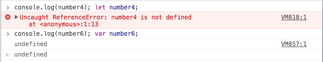
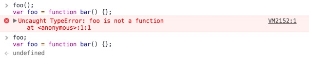

# 作用域和闭包

## 作用域是什么

**javaScript工作原理中的角色**
- 引擎 - 从头到尾负责整个javascript程序的编译及执行过程
- 编译器 - 负责语法分析及代码生成
- 作用域 - 负责收集并维护所有声明的标识符组成的一系列查询，并实施一套严格的规则，确定当前执行的代码对这些标识符的访问权限

### 作用域类型

  **作用域类型**
  - 词法作用域（javaScript所采用的作用域模型），词法作用域的`最重要特征是他的定义过程发生在代码的书写阶段（如果你没有使用eval和with）`。

  - 动态作用域 `作用域作为一个在运行时就被动态确定的形式`。（一些动态编程语言仍在使用如bash脚本、perl中的一些模式等）

事实上大部分语言都是基于词法作用域。

**词法作用域**

词法作用域是一套关于引擎如何寻找变量以及会在何处找到变量的规则。

**exam:**

    function foo() {     
      console.log( a ); // 2
    }
     function bar() {     
       var a = 3;     
       foo();
    }
    var a = 2;
    bar();

**分析:**
词法作用域让foo()中的a通过 RHS 引用到了全局作用域中的a，因此会输出2。而动态作用域并不关心函数和作用域是如何声明以及在何处声明的，只关心它们从何处调用。换句话说，
> 动态作用域作用域链是基于调用栈的，而不是代码中的作用域嵌套。

因此，如果 JavaScript 具有动态作用域，理论上，下面代码中的foo()在执行时将会输出3。

    function foo() {
        console.log( a ); // 3（不是2！）
    }
     function bar() {     
       var a = 3;     
       foo();
    }
    var a = 2;
    bar();

因为当foo()无法找到a的变量引用时，会顺着调用栈在调用foo()的地方查找a，而不是在嵌套的词法作用域链中向上查找。由于foo()是在bar()中调用的，引擎会检查bar()的作用域，并在其中找到值为3的变量a。
> 需要明确的是，事实上 JavaScript 并不具有动态作用域。它只有词法作用域，简单明了。
但是this机制某种程度上很像动态作用域。

**二者区别**
> 词法作用域是在写代码或者说定义时确定的，
> 而动态作用域是在运行时确定的。（this也是！）词法作用域关注函数在何处声明，而动态作用域关注函数从何处调用。

**eval、with**

eval() 函数会将传入的字符串当做 JavaScript 代码进行执行。

#### 词法作用域

#####  词法作用域类别

- 函数作用域
- 全局作用域

#####  函数作用域
- **函数表达式VS函数声明**

  **函数表达式**

  function 关键字可以用来在一个表达式中定义一个函数。

      let function_expression = function [name]([param1[, param2[, ..., paramN]]]) {
         statements
      };

    **函数声明**

    函数声明定义一个具有指定参数的函数。

      function name([param,[, param,[..., param]]]) {
         [statements]
      }

  区分函数声明和表达式最简单的方法是

  >看function关键字出现在声明中的位置（不仅仅是一行代码，而是整个声明中的位置）。
  >
  > 如果function是声明中的第一个词，那么就是一个函数声明，否则就是一个函数表达式。

  函数表达式可以是匿名的，而函数声明则不可以省略函数名——在 JavaScript 的语法中这是非法的。

#####  块级作用域
- let
- const

  **let**

  let 语句声明一个块级作用域的本地变量，并且可选的将其初始化为一个值。

  **let特性：**
  - 作用域规则 -- 块级作用域
  - 暂时性死区 （在相同的函数或块作用域内重新声明同一个变量会引发SyntaxError。）
  - 不存在变量提升

  

  **const**

  常量是块级作用域，很像使用 let 语句定义的变量。

  常量的值不能通过重新赋值来改变，并且不能重新声明。

> 函数作用域和块作用域的行为是一样的：任何声明在某个作用域内的变量，都将附属于这个作用域。

### 变量

### 变量的生命周期
当引擎使用变量时，它们的生命周期包含以下阶段：

- **声明阶段（Declaration Phase）** 这一阶段在作用域中注册了一个变量。

- **初始化阶段（Initialization Phase）** 这一阶段分配了内存并在作用域中让内存与变量建立了一个绑定。在这一步变量会被自动初始化为 undefined 。

- **赋值阶段（Assignment Phase）** 这一阶段为初始化变量分配具体的一个值。

> 注意，按照变量的生命周期过程，声明阶段与我们通常所说的变量声明是不同的术语。

简单来讲，引擎处理变量声明需要经过完整的这 3 个阶段：声明阶段，初始化阶段和赋值阶段。

- **var 变量的生命周期**

  假设一个场景，当 JavaScript 遇到了一个函数作用域，其中包含了 `var variable` 的语句。则在任何语句执行之前，这个变量在作用域的开头就通过了`声明阶段`并马上来到了`初始化阶段`（步骤一）。

  > 同时 `var variable` 在函数作用域中的位置并不会影响它的声明和初始化阶段的进行。

  在声明和初始化阶段之后，赋值阶段之前，变量的值便是 `undefined` 并已经可以被使用了。

  在`赋值阶段 variable = 'value' `语句使变量接受了它的初始化值（步骤二）。

  这里的`变量提升`严格的说是指变量在函数作用域的`开始位置就完成了声明和初始化阶段`。在这里这两个阶段之间并没有任何的间隙。

  让我们参考一个示例来研究。下面的代码创建了一个包含 `var` 语句的函数作用域：
  

     function multiplyByTen(number) {
       console.log(ten); // => undefined
       var ten;
       ten = 10;
       console.log(ten); // => 10
       return number * ten;
     }
     multiplyByTen(4); // => 40
    

  当 JavaScript 开始执行 multipleByTen(4) 时进入了函数作用域中，变量 ten 在第一个语句之前就经过了声明和初始化阶段，所以当调用 console.log(ten) 时打印为 undefined。

  当语句 ten = 10 为变量赋值了初始化值。在赋值后，语句 console.log(ten) 打印了正确的 10 值。

 - **函数声明的生命周期**

    对于一个 函数声明语句`function funName() {...} ` 那就更简单了。

    

    `声明、初始化和赋值阶段在封闭的函数作用域的开头便立刻进行（只有一步）`。 funName() 可以在作用域中的任意位置被调用，这与其声明语句所在的位置无关（它甚至可以被放在程序的最底部）。

        function sumArray(array) {
          return array.reduce(sum);
          function sum(a, b) {
            return a + b;
          }
        }
        sumArray([5, 10, 8]); // => 23

    当 JavaScript 执行 sumArray([5, 10, 8]) 时，它便进入了 sumArray 的函数作用域。在作用域内，任何语句执行之前的瞬间，sum 就经过了所有的三个阶段：声明，初始化和赋值阶段。

    这样 `array.reduce(sum)` 即使在它的声明语句 `function sum(a, b) {...} `之前也可以使用 `sum`。

  - **let 变量的生命周期**

    let 变量的处理方式不同于 var。
    > 主要区分点在于`let声明和初始化阶段是分开的。`

    

    现在让我们研究这样一个场景，当解释器进入了一个包含 `let variable `语句的块级作用域中。这个变量立即通过了`声明阶段`，并在作用域内注册了它的名称（步骤一）。

    然后解释器继续逐行解析块语句。

    > 这时如果你在这个阶段尝试访问 variable，JavaScript 将会抛出 `ReferenceError: variable is not defined`。因为这个变量的状态依然是`未初始化`的。

    此时 `variable` 处于临时死区中。

    当解释器到达语句 `let variable` 时，此时变量通过了`初始化阶段`（步骤二）。现在变量状态是初始化的并且访问它的值是 `undefined`。

    > 同时变量在此时也离开了临时死区。

    之后当到达赋值语句 `variable = 'value' `时，变量通过了`赋值阶段`（步骤三）。

    > 如果 JavaScript 遇到这样的语句 let variable = 'value' ，那么变量会在这一条语句中`同时`经过`初始化`和`赋值阶段`。

    让我们继续看一个示例。这里 let 变量 number 被创建在了一个块级作用域中：

        let condition = true;
        if (condition) {
          // console.log(number); // => Throws ReferenceError
          let number;
          console.log(number); // => undefined
          number = 5;
          console.log(number); // => 5
        }

    当 JavaScript 进入 `if (condition) {...}` 块级作用域中，`number` 立即通过了`声明阶段`。

    > 因为 number `尚未初始化`并且处于`临时死区`，此时试图访问该变量会抛出 ReferenceError: number is not defined.

    之后语句 `let number` 使其得以初始化。现在变量可以被访问，但它的值是 `undefined`。

    之后赋值语句 `number = 5` 当然也使变量经过了赋值阶段。

    > `const` 和 `class` 类型与 `let` 有着相同的生命周期，除了它们的赋值语句只会发生一次。

    - ** 为什么变量提升在 let 的生命周期中无效**

      > 如上所述，`变量提升`是变量的`耦合`声明并且在作用域的顶部完成初始化。

      然而 let 生命周期中将声明和初始化阶段`解耦`。这一解耦使 `let` 的`变量提升`现象消失。

      由于两个阶段之间的间隙创建了临时死区，在此时变量无法被访问。

      这就像科幻的风格一样，在 `let` 生命周期中由于`变量提升失效`所以产生了临时死区。

**var和let 的区别**
> 
### 变量赋值操作

**变量赋值操作执行两个操作：**
 1. 编译器在当前作用域声明一个变量（如果变量之前没有声明）
 2. 在运行时引擎会在作用域中查找该变量，如果能找到就赋值操作。

> 注意区分变量声明和变量初始化

**LHS查询 与 RHS查询**
- LHS查询 - 当变量出现在赋值操作的左侧时进行LHS查询，“赋值操作的目标是谁”，例如：var a = 2;
- RHS查询 - 当变量出现在赋值操作的右侧时进行RHS查询，“谁是赋值操作的源头”，console.log(a)

#### 异常
- ReferenceError（引用错误） 对象 ： 表明一个不存在的变量被引用。

  如果RHS查询在作用域链中找不到所需要的变量时候触发。
- TypeError（类型错误） 对象 ：用来表示值的类型非预期类型时发生的错误。
  如果RHS查询在作用域链中找到了变量，但是你对这个变量值进行不合理的操作时候触发。

### 变量提升
变量声明遵循以下规则：
  1. 包括变量和函数在内的所有声明都会在任何代码被执行前首先被处理。
  2. `有声明本身会被提升，而赋值或其他运行逻辑会留在原地。`如果提升改变了代码执行的顺序，会造成非常严重的破坏。
  3. 函数声明和变量声明都会被提升,函数会首先被提升，然后才是变量。
  4. 函数声明会被提升，但是`函数表达式却不会被提升`。

  例如：

    foo(); // 不是ReferenceError, 而是TypeError!
     var foo = function bar() {
        // ...
    };

  

  > 例如：var a = 2; 但 JavaScript 实际上会将其看成两个声明：var a; 和a = 2;。第一个定义声明是在编译阶段进行的。第二个赋值声明会被留在原地等待执行阶段。

## 闭包

    function f1(){
    　var n=999;
    　nAdd=function(){
        n+=1
      }  
      function f2(){
    　　alert(n);
    　}
    　return f2;
    }

    var result=f1();
    result(); // 999
    nAdd();
    result(); // 1000

[学习Javascript闭包（Closure）](http://www.ruanyifeng.com/blog/2009/08/learning_javascript_closures.html)

闭包就是能够读取其他函数内部变量的函数。

由于在Javascript语言中，只有函数内部的子函数才能读取局部变量，因此可以把闭包简单理解成"定义在一个函数内部的函数"。

所以，在本质上，闭包就是将函数内部和函数外部连接起来的一座桥梁。

###### 注意点：
- 无论通过何种手段将内部函数传递到所在的词法作用域以外，它都会持有对原始定义作用域的引用，无论在何处执行这个函数都会使用闭包。
- 在定时器、事件监听器、
Ajax 请求、跨窗口通信、Web Workers 或者任何其他的异步（或者同步）任务中，只要使用了回调函数，实际上就是在使用闭包！
- 尽管 IIFE 本身并不是观察闭包的恰当例子，但它的确创建了闭包，并且也是最常用来创建可以被封闭起来的闭包的工具。

## 总结
本文主要讲了三部分内容：
- 作用域、作用域类型等
- 变量生命周期（感觉重要）
- 变量提升
- 闭包（没有展开说）

##参考文档
- [学习Javascript闭包（Closure）](http://www.ruanyifeng.com/blog/2009/08/learning_javascript_closures.html)
- [JavaScript 变量的生命周期：为什么 let 不存在变量提升](http://zcfy.cc/article/javascript-variables-lifecycle-why-let-is-not-hoisted-976.html)
