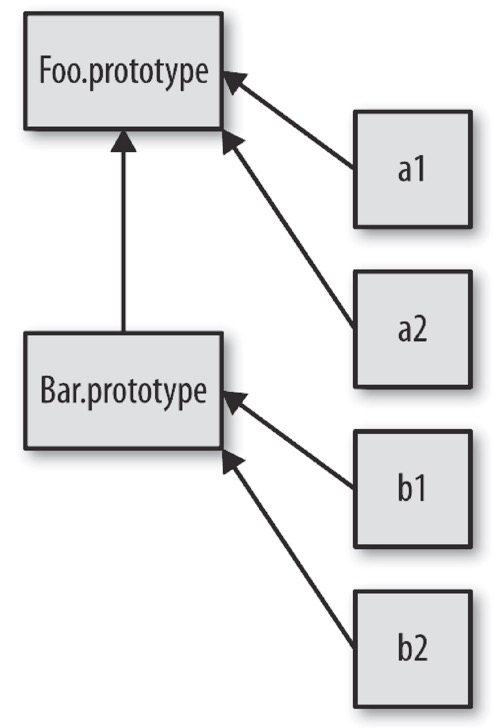

> 本文所有内容都来源于《你所不知道的javaScript上卷》和互联网，本人只做读书笔记的整理。

## 原型

### 1. [[Prototype]]
JavaScript 中的对象有一个特殊的 [[Prototype]] 内置属性: 对于其他对象的引用。

`几乎所有`的对象在创建时 [[Prototype]] 属性都会被赋予一个非空的值。

#### 1.1 [[Prototype]] 引用有什么用
当你试图引用对象的属性时会触发 [[Get]] 操作。

对于默认的 [[Get]] 操作来说，第一步是检查对象本身是否有这个属性，如果有的话就使用它。

但是如果 属性 不在 对象本身 中，就需要使用对象的 [[Prototype]] 链了。

    var anotherObject = {
      a:2
    };

    // 创建一个关联到 anotherObject 的对象
    var myObject = Object.create( anotherObject );
    myObject.a; // 2

myObject 对象的 [[Prototype]] 关联到了 anotherObject。显然 myObject.a 并不存在， 但是尽管如此，属性访问仍然成功地（在 anotherObject 中）找到了值 2。

但是，如果 anotherObject 中也找不到 a 并且 [[Prototype]] 链不为空的话，就会继续查找下去。

这个过程会持续到找到匹配的属性名或者查找完整条 [[Prototype]] 链。

**for..in - 同样会查找对象的整条原型链**

使用 for..in 遍历对象时原理和查找 [[Prototype]] 链类似，任何可以通过原型链访问到
（并且是 enumerable）的属性都会被枚举。

> 使用 in 操作符来检查属性在对象中是否存在时，同样会查找对象的整条原型链（无论属性是否可枚举）

#### 1.2 [[Prototype]] 的“尽头”
所有普通的 [[Prototype]] 链最终都会指向内置的 `Object.prototype`。

由于所有的“普通” （内置）对象都“源于”这个 Object.prototype 对象，所以它包含 JavaScript 中许多通用的功能。

    var ss = {}
    ss ==>

    {}
      __proto__:
        constructor:
            ƒ Object()
        hasOwnProperty:
            ƒ hasOwnProperty()
        isPrototypeOf:
            ƒ isPrototypeOf()
        propertyIsEnumerable:
            ƒ propertyIsEnumerable()
        toLocaleString:
            ƒ toLocaleString()
        toString:
            ƒ toString()
        valueOf:
            ƒ valueOf()
        __defineGetter__:
            ƒ __defineGetter__()
        __defineSetter__:
            ƒ __defineSetter__()
        __lookupGetter__:
            ƒ __lookupGetter__()
        __lookupSetter__:
            ƒ __lookupSetter__()
        get __proto__:
            ƒ __proto__()
        set __proto__:
            ƒ __proto__()

#### 1.3	属性设置和屏蔽
一个对象设置属性的过程：

    myObject.foo = "bar"；

- 如果 myObject 对象中包含名为 foo 的普通数据访问属性，这条赋值语句只会修改已有的属性值。

- 如果 foo 不是直接存在于 myObject 中，[[Prototype]] 链就会被遍历，类似 [[Get]] 操作。

- `如果原型链上找不到 foo`，foo 就会被直接添加到 myObject 上。

- 如果属性名 foo 既出现在 myObject 中也出现在 myObject 的 [[Prototype]] 链上层， 那么就会`发生屏蔽`。

  > myObject 中包含的 foo 属性会屏蔽原型链上层的所有 foo 属性，因为
myObject.foo 总是会选择原型链中最底层的 foo 属性。

如果 foo 不直接存在于 myObject 中而是存在于原型链上层时 myObject.foo = "bar" 会出现的三种情况。

- 如果在 [[Prototype]] 链上层存在名为 foo 的普通数据访问属性（）并且没有被标记为只读（writable:false），那就会直接在 myObject 中添加一个名为 foo 的新属性，它是屏蔽属性。
- 如果在 [[Prototype]] 链上层存在 foo，但是它被标记为只读（writable:false），那么无法修改已有属性或者在 myObject 上创建屏蔽属性。        
如果运行在严格模式下，代码会抛出一个错误。否则，这条赋值语句会被忽略。总之，不会发生屏蔽。
- 如果在 [[Prototype]] 链上层存在 foo 并且它是一个 setter（），那就一定会调用这个 setter。  
foo 不会被添加到（或者说屏蔽于）myObject，也不会重新定义 foo 这个 setter。

大多数开发者都认为如果向 [[Prototype]] 链上层已经存在的属性（[[Put]]）赋值，就一定会触发屏蔽，但是如你所见，三种情况中只有一种（第一种）是这样的。

如果你希望在第二种和第三种情况下也屏蔽 foo，那就不能使用 = 操作符来赋值，而是使用 `Object.defineProperty(..)`来向 myObject 添加 foo。

    var anotherObject = {
      a:2
    };
    var myObject = Object.create( anotherObject );
    anotherObject.a; // 2
    myObject.a; // 2

    anotherObject.hasOwnProperty( "a" ); // true
    myObject.hasOwnProperty( "a" ); // false

    myObject.a++; // 隐式屏蔽！

    anotherObject.a; // 2
    myObject.a; // 3

    myObject.hasOwnProperty( "a" ); // true

尽管 myObject.a++ 看起来应该（通过委托）查找并增加 anotherObject.a 属性，但是别忘了 ++ 操作相当于 myObject.a = myObject.a + 1。因此 ++ 操作首先会通过 [[Prototype]] 查找属性 a 并从 anotherObject.a 获取当前属性值 2，然后给这个值加 1，接着用 [[Put]] 将值 3 赋给 myObject 中新建的屏蔽属性 a，天呐！

修改委托属性时一定要小心。如果想让 anotherObject.a 的值增加， 唯一的办法是 anotherObject.a++。

### 2. “类”
为什么一个对象需要关联到另一个对象？这样做有什么好处？

JavaScript 和面向类的语言不同，它并没有类来作为对象的抽象模式或者说蓝图。

> JavaScript 中只有对象。

实际上，JavaScript 才是真正应该被称为“面向对象”的语言，因为它是少有的可以不通过类，直接创建对象的语言。

在 JavaScript 中，类无法描述对象的行为，（因为根本就不存在类！）对象直接定义自己的行为。

#### 2.1 “类”函数
多年以来，JavaScript 中有一种奇怪的行为一直在被无耻地滥用，那就是模仿类。

这种奇怪的“类似类”的行为利用了`函数`的`一种特殊特性`：
> 所有的函数默认都会拥有一个名为 prototype 的公有并且不可枚举的属性，它会指向另一个对象：

    function Foo() {
      // ...
    }

    Foo.prototype; // { }

这个对象通常被称为 Foo 的原型，因为我们通过名为 Foo.prototype 的属性引用来访问它。

抛开名字不谈，这个对象到底是什么？

这个对象是在调用 new Foo()时创建的，最后会被
（有点武断地）关联到这个“Foo 点 prototype”对象上。

    function  Foo() {
      // ...
    }

    var a = new Foo();
    Object.getPrototypeOf( a ) === Foo.prototype; // true

**Object.getPrototypeOf()** 方法返回指定对象的原型（内部[[Prototype]]属性的值）。

在面向类的语言中，类可以被复制（或者说实例化）多次，就像用模具制作东西一样。

但是在 JavaScript 中，并没有类似的复制机制。你不能创建一个类的多个实例，只能创建多个对象，它们 [[Prototype]] 关联的是同一个对象。  
但是在默认情况下并不会进行复制， 因此这些对象之间并不会完全失去联系，它们是互相关联的。

**注意:**

new Foo() 会生成一个新对象（我们称之为 a），这个新对象的内部链接 [[Prototype]] 关联的是 Foo.prototype 对象。

最后我们得到了两个对象，它们之间互相关联，就是这样。我们并没有初始化一个类，实际上我们并没有从“类”中复制任何行为到一个对象中，只是`让两个对象互相关联`。

**关于名称**

在JavaScript 中，我们并不会将一个对象（“类”）复制到另一个对象（“实例”），只是将它们关联起来。从视觉角度来说，[[Prototype]] 机制如下图所示，箭头从右到左，从下到上：

这个机制通常被称为`原型继承`。

#### 2.2 “构造函数”

    function  Foo() {
      // ...
    }

    var a = new Foo();

到底是什么让我们认为 Foo 是一个“类”呢？

- 其中一个原因是我们看到了关键字 new，在面向类的语言中构造类实例时也会用到它。
- 另一个原因是，看起来我们执行了类的构造函数方法，Foo() 的调用方式很像初始化类时类构造函数的调用方式。

    function Foo() {
      // ...
    }
    Foo.prototype.constructor === Foo; // true
    var a = new Foo();
    a.constructor === Foo; // true

Foo.prototype 默认（在代码中第一行声明时！）有一个公有并且不可枚举 的属性 .constructor，这个属性引用的是`对象关联的函数`（本例中是 Foo）。

此外，我们可以看到通过“构造函数”`调用 new Foo() 创建的对象`也有一个 .constructor 属性，指向 “创建这个对象的函数”。

**构造函数还是调用**

    function  Foo() {
      // ...
    }

    var a = new Foo();

这段代码很容易让人认为 Foo 是一个构造函数，因为我们使用 new 来调用它并且看到它“构造”了一个对象。

> 实际上，Foo 和你程序中的其他函数没有任何区别。
> 函数本身并不是构造函数，

然而，当你在普通的函数调用前面加上 new 关键字之后，就会把这个函数调用变成一个“构造函数调用”。

实际上，new 会`劫持所有普通函数并用构造对象的形式来调用它`。

> 在 JavaScript 中对于“构造函数”最准确的解释是，`所有带 new 的函数调用`。

函数不是构造函数，但是当且仅当使用 new 时，函数调用会变成“构造函数调用”。

#### 2.3 技术

    function Foo(name) {
      this.name = name;
    }

    Foo.prototype.myName = function() {
      return this.name;
    };

    var a = new Foo( "a" );
    var b = new Foo( "b" );
    a.myName(); // "a"
    b.myName(); // "b"

这段代码展示了另外两种“面向类”的技巧：

- `this.name = name` 给每个对象（ 也就是 a 和 b） 都添加了 .name 属性，有点像类实例封装的数据值。
- `Foo.prototype.myName = ...` 可能个更有趣的技巧，它会给 Foo.prototype 对象添加一个属性（函数）。现在，a.myName() 可以正常工作，但是你可能会觉得很惊讶，这是什么原理呢？

> **解释：** 在创建的过程中，a 和 b 的内部 [[Prototype]] 都会`关联`到 Foo.prototype 上。当 a 和 b 中无法找到 myName 时，它会（通过委托）在 Foo.prototype 上找到。

**回顾“构造函数”**

之前讨论 .constructor 属性时我们说过，看起来 a.constructor === Foo 为真意味着 a 确实有一个指向 Foo 的 .constructor 属性，但是事实不是这样。

这是一个很不幸的误解。实际上，.constructor 引用同样被`委托`给了 Foo.prototype，而
Foo.prototype.constructor 默认指向 Foo。

Foo.prototype 的 .constructor 属性只是 Foo 函数在声明时的默认属性。   
如果你创建了一个新对象并`替换`了函数默认的 .prototype 对象引用，那么`新对象并不会自动获得 .constructor 属性`。

    function Foo() {
      ...
    }
    Foo.prototype = {
      ...
    }; // 创建一个新原型对象

    var a1 = new Foo();
    a1.constructor === Foo; // false!
    a1.constructor === Object; // true!

a1 并没有 .constructor 属性，所以它会委托 [[Prototype]] 链上的 Foo.prototype。  
但是这个对象也没有 .constructor 属性（不过默认的 Foo.prototype 对象有这个属性！），所以它会继续委托，这次会委托给委托链顶端的 Object.prototype。  
这个对象有 .constructor 属性，指向内置的 Object(..) 函数。

**手动添加 .constructor 属性**

你可以给 Foo.prototype 添加一个.constructor 属性，不过这需要手动添加一个符合正常行为的不可枚举属性。

    function Foo() {
      ...
    }
    Foo.prototype = {
      ...
      }; // 创建一个新原型对象

    // 需要在 Foo.prototype 上“修复”丢失的 .constructor 属性
    // 新对象属性起到 Foo.prototype 的作用
    // 关于 defineProperty(..)，

    Object.defineProperty( Foo.prototype, "constructor" ,
    {
      enumerable: false,
      writable: true,
      configurable: true,
      value: Foo // 让 .constructor 指向 Foo
    });

修复 .constructor 需要很多手动操作。

> a1.constructor 是一个非常不可靠并且不安全的引用。通常来说要尽量避免使用这些引用。

### 3.（原型）继承

我们已经看过了许多 JavaScript 程序中常用的模拟类行为的方法，但是如果没有“继承” 机制的话，JavaScript 中的类就只是一个空架子。

实际上，我们已经了解了通常被称作`原型继承的机制`，a 可以“继承”`Foo.prototype` 并访问 `Foo.prototype 的 myName()` 函数。

如上图，它不仅展示出对象（实例）a1 到 Foo.prototype 的`委托`关系，还展示出
Bar.prototype 到 Foo.prototype 的委托关系，而后者和类继承很相似，只有箭头的方向不同。

图中由下到上的箭头表明这是`委托关联`，`不是复制操作`。

    function Foo(name) {
      this.name = name;
    }

    Foo.prototype.myName = function() {
      return this.name;
    };

    function Bar(name,label) {
      Foo.call( this, name );    
      this.label = label;
    }

    // 我们创建了一个新的 Bar.prototype 对象并关联到 Foo.prototype Bar.prototype = Object.create( Foo.prototype );

    // 注意！现在没有 Bar.prototype.constructor 了
    // 如果你需要这个属性的话可能需要手动修复一下它

    Bar.prototype.myLabel = function() {
      return this.label;
    };

    var a = new Bar( "a", "obj a" );

    a.myName(); // "a"
    a.myLabel(); // "obj a"

这段代码的核心部分就是语句
> Bar.prototype = Object.create( Foo.prototype )。

调用 Object.create(..) 会凭空创建一个“新”对象并把新对象内部的 [[Prototype]] 关联到你指定的对象（本例中是 Foo.prototype）。

注意，下面这两种方式是常见的错误做法，实际上它们都存在一些问题：

  - // 和你想要的机制不一样！  
  Bar.prototype = Foo.prototype;

  - // 基本上满足你的需求，但是可能会产生一些副作用 :(  
  Bar.prototype = new Foo();

Bar.prototype = Foo.prototype 并不会创建一个关联到 Bar.prototype 的新对象， 它只是让 `Bar.prototype 直接引用 Foo.prototype 对象`。

因此当你执行类似 Bar.prototype. myLabel = ... 的赋值语句时会直接修改 Foo.prototype 对象本身。

Bar.prototype = new Foo() 的确会创建一个关联到 Bar.prototype 的新对象。但是它使用了 Foo(..) 的“构造函数调用”，如果函数 Foo 有一些副作用（比如写日志、修改状态、注册到其他对象、给 this 添加数据属性，等等）的话，就会影响到 Bar() 的“后代”，后果不堪设想。

> 因此，要创建一个合适的关联对象，我们必须使用 `Object.create(..)` 而不是使用具有副作用的 Foo(..)。
>
> 这样做唯一的缺点: 就是需要创建一个新对象然后把旧对象抛弃掉，不能直接修改已有的默认对象。

**一个标准并且可靠的方法来修改对象的 [[Prototype]] 关联**  
- 在 ES6 之前， 我们只能通过设置 `.__proto__`  属性来实现，但是这个方法并不是标准并且无法兼容所有浏览器。
- ES6 添加了辅助函数 `Object.setPrototypeOf(..)`，可以用标准并且可靠的方法来修改关联。

**对比一下两种把 Bar.prototype 关联到 Foo.prototype 的方法**

  // ES6 之 前 需 要 抛 弃 默 认 的 Bar.prototype   
  Bar.ptototype = Object.create( Foo.prototype );

  // ES6 开 始 可 以 直 接 修 改 现 有 的 Bar.prototype  
  Object.setPrototypeOf( Bar.prototype, Foo.prototype );

如果忽略掉 Object.create(..) 方法带来的轻微性能损失（抛弃的对象需要进行垃圾回收），它实际上比 ES6 及其之后的方法更短而且可读性更高。

#### 3.1 检查“类”关系

如何寻找对象 a 委托的对象（如果存在的话）呢？

在传统的面向类环境中, 检查一个实例（JavaScript 中的对象）的继承祖先（JavaScript 中的委托关联）通常被称为`内省（或者反射）`。

    function  Foo() {
      // ...
    }

    Foo.prototype.blah = ...;

    var a = new Foo();

我们如何通过内省找出 a 的“祖先”（委托关联）呢？

- 第一种方法是站在“类”的角度来判断：
  > a instanceof Foo; // true

  instanceof 操作符的左操作数是一个普通的对象，右操作数是一个函数。  
  instanceof 回答的问题是：在 a 的整条 [[Prototype]] 链中是否有指向 Foo.prototype 的对象？  
  这个方法只能处理: `对象（a）和函数（带 .prototype 引用的 Foo）之间的关系`。  
  如果想判断两个对象（比如 a 和 b）之间是否通过 [[Prototype]] 链关联，只用 instanceof 无法实现。
- 第二种判断 [[Prototype]] 反射的方法，它更加简洁：
  > Foo.prototype.isPrototypeOf( a ); // true

  注意，在本例中，我们实际上并不关心（甚至不需要）Foo，我们只需要一个可以用来判断的对象（本例中是 Foo.prototype）就行。  
  isPrototypeOf(..) 回答的问题是：`在 a 的整条 [[Prototype]] 链中是否出现过 Foo.prototype ？`

同样的问题， 同样的答案， 但是在第二种方法中并不需要间接引用函数（Foo）， 它的 `.prototype 属性会被自动访问`。

> **我们只需要两个对象就可以判断它们之间的关系**。

**举例来说：**

    // 非常简单：b 是否出现在 c 的 [[Prototype]] 链中？
    b.isPrototypeOf( c );

#### 3.2 直接获取一个对象的 [[Prototype]] 链

  - 在 ES5 中，标准的方法是：
    > Object.getPrototypeOf( a );

  - 绝大多数（不是所有！）浏览器也支持一种非标准的方法来访问内部 [[Prototype]] 属性：

    > `a.__proto__` === Foo.prototype; // true

    这个奇怪的 `.__proto__`（ 在 ES6 之前并不是标准！） 属性“ 神奇地” 引用了内部的 [[Prototype]] 对象，如果你想直接查找（甚至可以通过 `.__proto__.__proto__`... 来遍历） 原型链的话，这个方法非常有用。

### 4. 对象关联

[[Prototype]] 机制就是存在于对象中的一个内部链接，它会引用其他对象。

这个链接的作用是：如果在对象上没有找到需要的属性或者方法引用，引擎就会继续在 [[Prototype]] 关联的对象上进行查找。同理，如果在后者中也没有找到需要的引用就会继续查找它的 [[Prototype]]，以此类推。这一系列对象的链接被称为`“原型链”`。

### 4.1	创建关联
我们已经明白了为什么 JavaScript 的 [[Prototype]] 机制和类不一样(JS 中是关联而不是复制)，也明白了它如何建立对象间的关联。

那 [[Prototype]] 机制的意义是什么呢？为什么 JavaScript 开发者费这么大的力气（模拟类）在代码中创建这些关联呢？

    var foo = {
      something: function() {
        console.log( "Tell me something good..." );
      }
    };

    var bar = Object.create( foo );
    bar.something(); // Tell me something good...

Object.create(..) 会创建一个新对象（bar）并把它关联到我们指定的对象（foo），这样我们就可以充分发挥 [[Prototype]] 机制的威力（委托）并且避免不必要的麻烦（比如使用 new 的构造函数调用会生成 .prototype 和 .constructor 引用）。

> 我们并不需要类来创建两个对象之间的关系，只需要通过委托来关联对象就足够了。
>
> 而 Object.create(..) 不包含任何“类的诡计”，所以它可以完美地创建我们想要的关联关系。

### 总结：
- 如果要访问对象中并不存在的一个属性，[[Get]] 操作就会查找对象内部 [[Prototype]] 关联的对象。这个关联关系实际上定义了一条“原型链”（有点像嵌套的作用域链），在查找属性时会对它进行遍历。
- 所有普通对象都有内置的 Object.prototype，指向原型链的顶端（比如说全局作用域），如果在原型链中找不到指定的属性就会停止。
- toString()、valueOf() 和其他一些通用的功能都存在于 Object.prototype 对象上，因此语言中所有的对象都可以使用它们。
- 虽然 JavaScript 机制和传统面向类语言中的“类初始化”和“类继承”很相似，但是 JavaScript 中的机制有一个核心区别，
    > 那就是不会进行复制，对象之间是通过内部的[[Prototype]] 链关联的。

- 如何寻找对象 a 委托的对象（如果存在的话）呢？
  - 第一种方法是站在“类”的角度来判断：
    > a instanceof Foo; // true

  - 第二种判断 [[Prototype]] 反射的方法，它更加简洁：
    > Foo.prototype.isPrototypeOf( a ); // true
    >
    > b.isPrototypeOf( c );

- 直接获取一个对象的 [[Prototype]] 链
  - 在 ES5 中，标准的方法是：
    > Object.getPrototypeOf( a );

  - 绝大多数（不是所有！）浏览器也支持一种非标准的方法来访问内部 [[Prototype]] 属性：
    > `a.__proto__` === Foo.prototype; // true
    
- 对象关联
