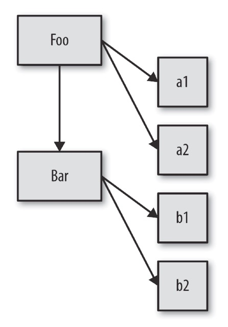
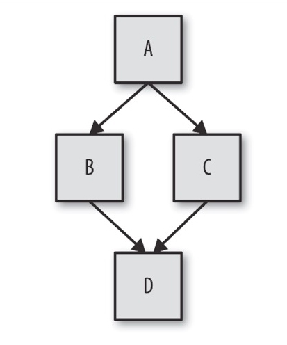

> 本文所有内容都来源于《你所不知道的javaScript上卷》和互联网，本人只做读书笔记的整理。

# 混合对象“类”

面向类的设计模式：
  - 实例化（instantiation）
  - 继承（inheritance）
  - （相对）多态（polymorphism）

### 1. 什么是“类“

类 / 继承描述了一种代码的组织结构形式——一种在软件中对真实世界中问题领域的`“建模方法”`。

面向对象编程强调的是`数据和操作数据的行为本质上是互相关联的`（当然，不同的数据有不同的行为）。

数据结构 -- 把数据以及和它相关的行为打包（或者说封装）起来。

> `所有字符串都是 String 类的一个实例`，也就是说它是一个包裹，包含字符数据和我们可以应用在数据上的函数。

**主要概念：**

  - 类 -- ECMAScript 2015 中引入的 JavaScript 类(classes) 实质上是 JavaScript 现有的基于原型的继承的语法糖。

    类语法不是向JavaScript引入一个新的面向对象的继承模型。JavaScript类提供了一个更简单和更清晰的语法来创建对象并处理继承。

  - 继承 -- 继承的对象函数并不是通过复制而来，而是通过原型链继承（通常被称为 原型式继承 —— prototypal inheritance）。

  - 实例化 -- 实例化一个对象 就是为对象开辟内存空间，或者是不用声明，直接使用,用某个类创建一个对象，就叫对象实例化。

        function test(num){
          this.num = num;
        }

        var number = new test(123);

  - 多态 -- 父类的通用行为可以被子类用更特殊的行为重写。    
  实际上，相对多态性允许我们从重写行为中引用基础行为。

  > 类理论强烈建议父类和子类使用相同的方法名来表示特定的行为，从而让子类重写父类。

**我们来看一个常见的例子:**

“汽车”可以被看作“交通工具”的一种特例，后者是更广泛的`类`。

我们可以在软件中定义一个 Vehicle `类`和一个 Car `类`来对这种关系进行`建模`。

Vehicle 的定义可能包含推进器（比如引擎）、载人能力等等，这些都是 Vehicle 的行为。我们在Vehicle 中定义的是（几乎）所有类型的交通工具（飞机、火车和汽车）都包含的东西。

在我们的软件中，对不同的交通工具重复定义“载人能力”是没有意义的。相反，我们只在 Vehicle 中定义一次，定义 Car 时，只要声明它`继承`（或者扩展）了 Vehicle 的这个基础定义就行。Car 的定义就是对通用 Vehicle 定义的特殊化。

虽然 Vehicle 和 Car 会定义相同的方法，但是`实例`中的数据可能是不同的，比如每辆车独一无二的 VIN（Vehicle Identification Number，车辆识别号码），等等。

**这就是类、继承和实例化。**

#### 1.1 	“类”设计模式
面向对象设计模式:

  - 迭代器模式、
  - 观察者模式、
  - 工厂模式、
  - 单例模式，
  - 等等

你可能从来没把类作为设计模式来看待

> 类并不是必须的编程基础，而是一种可选的代码抽象。

#### 1.2 JavaScript中的“类”
有些语言（比如 Java）并不会给你选择的机会，类并不是可选的——万物皆是类。

其他语言（比如 C/C++ 或者 PHP）会提供过程化和面向类这两种语法，开发者可以选择其中一种风格或者混用两种风格。

JavaScript 属于哪一类呢？

在相当长的一段时间里，JavaScript 只有一些近似类的语法元素
（比如new 和instanceof），不过在后来的 ES6 中新增了一些元素，比如class 关键字。

这是不是意味着 JavaScript 中实际上有类呢？简单来说：不是。

> JavaScript 中实际上没有类。

> JavaScript 的机制其实和类完全不同

在软件设计中类是一种可选的模式，你需要自己决定是否在 JavaScript 中使用它。

### 2.	类的机制
#### 2.1	建造
“类”和“实例”的概念来源于房屋建造。

一个类就是一张蓝图。

为了获得真正可以交互的对象，我们必须按照类来`建造`（也可以说`实例化`）一个东西，这个东西通常被称为`实例`。

有需要的话，我们可以直接在实例上调用方法并访问其所有公有数据属性。

这个对象就是类中描述的所有特性的一份副本。

构造函数

#### 2.2 构造函数
类实例是由一个特殊的类方法构造的，这个方法名通常和类名相同，被称为构造函数。

这个方法的任务就是初始化实例需要的所有信息（状态）。

举例来说，思考下面这个关于类的伪代码（编造出来的语法）：

    class CoolGuy {
      specialTrick = nothing
      CoolGuy( trick ) {
        specialTrick = trick
      }

      showOff() {
        output( "Here's my trick: ", specialTrick )
      }
    }

我们可以调用类构造函数来生成一个 CoolGuy 实例：

    Joe = new CoolGuy( "jumping rope" )
    Joe.showOff() // 这是我的绝技：跳绳

**注意：**

  - CoolGuy 类有一个 CoolGuy() 构造函数，执行 new CoolGuy() 时实际上调用的就是它。
  - 构造函数会返回一个对象（也就是类的一个实例），之后我们可以在这个对象上调用
showOff() 方法，来输出指定 CoolGuy 的特长。

**总结：**
  - 类构造函数属于类，而且通常和类同名。
  - 构造函数大多需要用 new 来调用

### 3. 类的继承
定义好一个子类之后，相对于父类来说它就是一个独立并且完全不同的类。

子类会包含父类行为的原始副本，但是也可以重写所有继承的行为甚至定义新行为。

> 非常重要的一点是，我们讨论的父类和子类`并不是实例`。

父类和子类的比喻容易造成一些误解，实际上我们应当把父类和子类称为父类 DNA 和子类 DNA。我们需要根据这些 DNA 来创建（或者说实例化）一个人，然后才能和他进行沟通。

**思考下面关于类继承的伪代码**

    class Vehicle {
      engines = 1

      ignition() {
        output( "Turning on my engine." );
      }

      drive() {
        ignition();
        output( "Steering and moving forward!" )
      }
    }

    class Car inherits Vehicle {
      wheels = 4

      drive() {
        inherited:drive()
        output( "Rolling on all ", wheels, " wheels!" )
      }
    }

    class SpeedBoat inherits Vehicle {
      engines = 2

      ignition() {
        output( "Turning on my ", engines, " engines." )
      }

      pilot() {
        inherited:drive()
        output( "Speeding through the water with ease!" )
      }
    }

#### 3.1 多态
Car 重写了继承自父类的 drive() 方法， 但是之后 Car 调用了 inherited:drive() 方法， 这表明 Car 可以引用继承来的原始 drive() 方法。

快艇的 pilot() 方法同样引用了原始 drive() 方法。

这个技术被称为多态或者虚拟多态。

在许多语言中可以使用 `super` 来代替本例中的 inherited:，  
它的含义是“ 超类”
（superclass），表示当前类的父类 / 祖先类。

**多态：**
- 任何方法都可以`引用继承`层次中高层的方法（无论高层的方法名和当前方法名是否相同）。
- 在继承链的不同层次中一个方法名可以被`多次定义`，当调用方法时会自动选择合适的定义。

**super**

  在传统的面向类的语言中 super 还有一个功能，就是从子类的构造函数中通过super 可以直接调用父类的构造函数。

  通常来说这没什么问题，因为对于`真正的类`来说，构造函数是属于类的。

  > 在JavaScript 中恰好相反——实际上“类”是属于构造函数的（类似Foo.prototype... 这样的类型引用）。

  由于 JavaScript 中父类和子类的关系只存在于两者构造函数对应的 .prototype 对象中，  
  因此`它们的构造函数之间并不存在直接联系`，从而无法简单地实现两者的相对引用（在 ES6 的类中可以通过 super 来“解决”这个问题）。

  在子类（而不是它们创建的实例对象！）中也可以相对引用它继承的父类，这种相对引用通常被称为 super。

  **详见下图：**

  

  注意这些实例（a1、a2、b1 和 b2）和继承（Bar），箭头表示复制操作。

  从概念上来说，子类 Bar 应当可以通过相对多态引用（或者说 super）来访问父类 Foo 中的行为。

  > 需要注意，子类得到的仅仅是继承自父类行为的一份副本。

  > 子类对继承到的一个方法进行“重写”，不会影响父类中的方法，这两个方法互不影响，

  因此才能使用相对多态引用访问父类中的方法（如果重写会影响父类的方法，那重写之后父类中的原始方法就不存在了，自然也无法引用）。

  多态并不表示子类和父类有关联，子类得到的只是父类的一份副本。

  > 类的继承其实就是复制。（javaScript中不存在类）

#### 3.2 多重继承
有些面向类的语言允许你继承多个“父类”。

多重继承意味着所有父类的定义都会被复制到子类中。

**钻石问题**

在钻石问题中，子类 D 继承自两个父类（B 和 C），这两个父类都继承自 A。如果 A 中有 drive() 方法并且 B 和 C 都重写了这个方法
（多态），那当 D 引用 drive() 时应当选择哪个版本呢（B:drive() 还是 C:drive()）？

这些问题远比看上去要复杂得多。

相比之下，JavaScript 要简单得多：

> JavaScript本身并不提供“多重继承”功能。

### 4.	混入
在继承或者实例化时，JavaScript 的对象机制`并不会自动执行复制行为`。

> JavaScript 中只有对象，并不存在可以被实例化的“类”。
>
> 一个对象并不会被复制到其他对象，它们会被`关联`起来

由于在其他语言中类表现出来的都是复制行为，因此JavaScript 开发者也想出了一个方法来模拟类的复制行为，这个方法就是`混入`。

主要两种类型的混入：显式和隐式。

#### 4.1	显式混入
我们来回顾一下之前提到的 Vehicle 和 Car。

由于 JavaScript 不会自动实现 Vehicle 到 Car 的复制行为，所以我们需要`手动实现复制功能`。

这个功能在许多库和框架中被称为`extend(..)`，但是为了方便理解我们称之为 `mixin(..)`。

    // 非常简单的 mixin(..) 例子 :
    function mixin( sourceObj, targetObj ) {
      for (var key in sourceObj) {
        // 只会在不存在的情况下复制
        if (!(key in targetObj)) {
          targetObj[key] = sourceObj[key];
        }
      }

      return targetObj;
    }

    var Vehicle = {
      engines: 1,

      ignition: function() {
        console.log( "Turning on my engine." );
      },

      drive: function() {
        this.ignition();
        console.log( "Steering and moving forward!" );
      }
    };

    var Car = mixin( Vehicle, {
      wheels: 4,

      drive: function() {
        Vehicle.drive.call( this );
        console.log(
          "Rolling on all " + this.wheels + " wheels!"
        );
      }
    });

> 一点需要注意，我们处理的已经不再是类了，因为在 JavaScript 中不存在类，Vehicle 和 Car 都是对象，供我们分别进行复制和粘贴。

现在 Car 中就有了一份 Vehicle 属性和函数的副本了。
> 从技术角度来说，函数实际上没有被复制，复制的是函数引用。

所以，Car 中的属性 ignition 只是从 Vehicle 中复制过来的对于 ignition() 函数的引用。相反，属性 engines 就是直接从 Vehicle 中复制了值 1。

Car 已经有了 drive 属性（函数），所以这个属性引用并没有被 mixin 重写，从而保留了 Car 中定义的同名属性，实现了`“子类”对“父类”属性的重写`（参见 mixin(..) 例子中的 if 语句）。

##### 4.1.1 再说多态
我们来分析一下这条语句：`Vehicle.drive.call( this )`。这就是我所说的`显式多态`。

还记得吗，在之前的伪代码中对应的语句是 `inherited:drive()`，我们称之为`相对多态`。

JavaScript（ 在 ES6 之前 ） 并没有相对多态的机制。所以， 由于 Car 和 Vehicle 中都有 drive() 函数，为了指明调用对象，我们必须使用绝对（而不是相对）引用。我们通过名称显式指定 Vehicle 对象并调用它的 drive() 函数。

但是如果直接执行 Vehicle.drive()，函数调用中的 this 会被绑定到 Vehicle 对象而不是 Car 对象 ，这并不是我们想要的。

因此，我们会使用 .call(this) 来确保 drive() 在 Car 对象的上下文中执行。

> 使用伪多态通常会导致代码变得更加复杂、难以阅读并且难以维护，
> 因此应当尽量避免使用显式伪多态，因为这样做往往得不偿失。

##### 4.1.2 混合复制
回顾一下之前提到的 mixin(..) 函数：

    // 非常简单的 mixin(..) 例子 :
    function mixin( sourceObj, targetObj ) {
      for (var key in sourceObj) {
        // 只会在不存在的情况下复制
        if (!(key in targetObj)) {
          targetObj[key] =   sourceObj[key];
        }
      }
      return targetObj;
    }

mixin(..) 的工作原理：

它会遍历 sourceObj（本例中是 Vehicle）的属性，如果在 targetObj（本例中是 Car）没有这个属性就会进行复制。

由于我们是在目标对象初始化之后才进行复制，因此一定要小心不要覆盖目标对象的原有属性。

复制操作完成后，Car 就和 Vehicle 分离了，向 Car 中添加属性不会影响 Vehicle，反之亦然。

> 由于两个对象引用的是同一个函数，因此这种复制（或者说混入）实际上并不能完全模拟面向类的语言中的复制。

> JavaScript 中的函数无法（用标准、可靠的方法）真正地复制，所以你只能复制对共享函数对象的引用（函数就是对象）。

如果你修改了共享的函数对象（比如ignition()），比如添加了一个属性，那 Vehicle 和 Car 都会受到影响。

显式混入是 JavaScript 中一个很棒的机制，不过它的功能也没有看起来那么强大。虽然它可以把一个对象的属性复制到另一个对象中，但是这其实并不能带来太多的好处，无非就是少几条定义语句，而且还会带来我们刚才提到的函数对象引用问题。

> 一定要注意，只在能够提高代码可读性的前提下使用显式混入，避免使用增加代码理解难度或者让对象关系更加复杂的模式。

如果使用混入时感觉越来越困难，那或许你应该停止使用它了。实际上，如果你必须使用一个复杂的库或者函数来实现这些细节，那就标志着你的方法是有问题的或者是不必要的。

##### 4.1.3 寄生继承
显式混入模式的一种变体被称为“寄生继承”，它既是显式的又是隐式的。

    //“传统的 JavaScript 类”Vehicle
    function Vehicle() {
      this.engines = 1;
    }
    Vehicle.prototype.ignition = function() {
      console.log( "Turning on my engine." );
    };
    Vehicle.prototype.drive = function() {
      this.ignition();
      console.log( "Steering and moving forward!" );
    };

.

    //“寄生类”Car
    function Car() {
      // 首先，car 是一个 Vehicle
      var car = new Vehicle();

      // 接着我们对 car 进行定制
      car.wheels = 4;

      // 保存到 Vehicle::drive() 的特殊引用
      var vehDrive = car.drive;

      // 重写 Vehicle::drive()
      car.drive = function() {
        vehDrive.call( this );
        console.log( "Rolling on all " + this.wheels + " wheels!"
      );

      return car;
    }

    var myCar = new Car();
    myCar.drive();
    // 发动引擎。
    // 手握方向盘！
    // 全速前进！

首先我们复制一份 Vehicle 父类（对象）的定义，然后混入子类（对象）的定义（如果需要的话保留到父类的特殊引用），然后用这个复合对象构建实例。

#### 4.2	隐式混入
隐式混入和之前提到的显式伪多态很像，因此也具备同样的问题。

    var Something = {
      cool: function() {
        this.greeting = "Hello World";
        this.count = this.count ? this.count + 1 : 1;
      }
    };

    Something.cool();
    Something.greeting; // "Hello World"
    Something.count; // 1

    var Another = {
      cool: function() {
        // 隐式把 Something 混入 Another
         Something.cool.call( this );
      }
    };

    Another.cool();
    Another.greeting; // "Hello World"
    Another.count; // 1（count 不是共享状态）

通过在构造函数调用或者方法调用中使用 Something.cool.call( this )，我们实际上“借用”了函数 Something.cool() 并在 Another 的上下文中调用了它（通过 this 绑定）。最终的结果是 Something.cool() 中的赋值操作都会应用在 Another 对象上而不是 Something 对象上。

### 5.	小结
- 类是一种设计模式。
- 许多语言提供了对于面向类软件设计的原生语法。JavaScript 也有类似的语法，但是和其他语言中的类完全不同。
- 类意味着复制。-- 传统的类被实例化时，它的行为会被复制到实例中。类被继承时，行为也会被复制到子类中。
- JavaScript 并不会（像类那样）自动创建对象的副本。
- 多态（在继承链的不同层次名称相同但是功能不同的函数）看起来似乎是从子类引用父类，但是本质上引用的其实是复制的结果。
- 混入模式（无论显式还是隐式）可以用来模拟类的复制行为，但是通常会产生丑陋并且脆弱的语法，比如显式伪多态（OtherObj.methodName.call(this, ...)），这会让代码更加难懂并且难以维护。

## Javascript定义类（class）的几种方法
将近20年前，Javascript诞生的时候，只是一种简单的网页脚本语言。如今，它变得几乎无所不能，从前端到后端，有着各种匪夷所思的用途。程序员用它完成越来越庞大的项目。

Javascript代码的复杂度也直线上升。单个网页包含10000行Javascript代码，早就司空见惯。2010年，一个工程师透露，Gmail的代码长度是443000行！

编写和维护如此复杂的代码，必须使用`模块化策略`。

目前，业界的主流做法是采用"`面向对象编程`"。

> 因此，Javascript如何实现面向对象编程，就成了一个热门课题。

麻烦的是:
> Javascipt语法不支持"类"（class），

导致传统的面向对象编程方法无法直接使用。

程序员们做了很多探索，研究如何用Javascript模拟"类"。

本文总结了Javascript定义"类"的三种方法，讨论了每种方法的特点。

#### 1. 构造函数法
这是经典方法，它用构造函数模拟"类"，在其内部用this关键字指代实例对象。

    function Cat() {
      this.name = "大毛";
      this.hobby=function(){  
          var p = document.createElement("p");  
          var txt = document.createTextNode("三妹");  
          p.appendChild(txt);  
          document.body.appendChild(p);  
      }  
    }

生成实例的时候，使用new关键字。

    var cat1 = new Cat();
    alert(cat1.name); // 大毛  

**缺点：** -- 比较复杂，用到了this和prototype，编写和阅读都很费力。

#### 2. Object.create()法
Javascript的国际标准ECMAScript第五版（ES5），提出了一个新的方法`Object.create()`。

用这个方法，"类"就是一个对象，不是函数。

    var Cat = {
      name: "大毛",
      makeSound: function(){
        alert("喵喵喵");
      }
    };

然后，直接用Object.create()生成实例，不需要用到new。

    var cat1 = Object.create(Cat);
    alert(cat1.name); // 大毛
    cat1.makeSound(); // 喵喵喵

目前，各大浏览器的最新版本（包括IE9）都部署了这个方法。如果遇到老式浏览器，可以用下面的代码自行部署。

    if (!Object.create) {
      Object.create = function (o) {
        function F() {}
        F.prototype = o;
        return new F();
      };
    }

**优点：**
- 比"构造函数法"简单

**缺点：**
- 能实现私有属性和私有方法
- 实例对象之间也不能共享数据，对"类"的模拟不够全面。

#### 3. 极简主义法

##### 3.1 封装
这种方法不使用this和prototype，代码部署起来非常简单，这大概也是它被叫做"极简主义法"的原因。

首先，它也是用一个对象模拟"类"。在这个类里面，定义一个构造函数createNew()，用来生成实例。

    var Cat = {
      createNew: function(){
        // some code here
        }
    };

然后，在createNew()里面，定义一个实例对象，把这个实例对象作为返回值。

    var Cat = {
      createNew: function(){
        var cat = {};
        cat.name = "大毛";
        cat.makeSound = function(){
          alert("喵喵喵");
        };
        return cat;
      }
    };

使用的时候，调用createNew()方法，就可以得到实例对象。

    var cat1 = Cat.createNew();
    cat1.makeSound(); // 喵喵喵

这种方法的好处是，容易理解，结构清晰优雅，符合传统的"面向对象编程"的构造，因此可以方便地部署下面的特性。

##### 3.2 继承
让一个类继承另一个类: 只要在前者的createNew()方法中，调用后者的createNew()方法即可。

先定义一个Animal类。

    var Animal = {
      createNew: function(){
        var animal = {};
          animal.sleep = function(){
            alert("睡懒觉");
          };
          return animal;
        }
    };

然后，在Cat的createNew()方法中，调用Animal的createNew()方法。

    var Cat = {
      createNew: function(){
        var cat = Animal.createNew();
        cat.name = "大毛";
        cat.makeSound = function(){
          alert("喵喵喵");
        };
        return cat;
      }
    };

这样得到的Cat实例，就会同时继承Cat类和Animal类。

    var cat1 = Cat.createNew();
    cat1.sleep(); // 睡懒觉

##### 3.3 私有属性和私有方法
在createNew()方法中，只要不是定义在cat对象上的方法和属性，都是私有的。

    var Cat = {
      createNew: function(){
        var cat = {};
          var sound = "喵喵喵";
          cat.makeSound = function(){
            alert(sound);
          };
          return cat;
        }
    };

上例的内部变量sound，外部无法读取，只有通过cat的公有方法makeSound()来读取。

    var cat1 = Cat.createNew();
    alert(cat1.sound); // undefined

##### 3.4 数据共享
有时候，我们需要所有实例对象，能够读写同一项内部数据。

这个时候，只要把这个内部数据，封装在`类对象的里面、createNew()方法的外面`即可。

    var Cat = {
      sound : "喵喵喵",
      createNew: function(){
        var cat = {};
        cat.makeSound = function(){
          alert(Cat.sound);
        };
        cat.changeSound = function(x){
          Cat.sound = x;
        };
        return cat;
      }
    };

然后，生成两个实例对象：

    var cat1 = Cat.createNew();
    var cat2 = Cat.createNew();
    cat1.makeSound(); // 喵喵喵

这时，如果有一个实例对象，修改了共享的数据，另一个实例对象也会受到影响。

    cat2.changeSound("啦啦啦");
    cat1.makeSound(); // 啦啦啦

#### 4. 工厂模式

    //工厂模式  
    function oj(){  
        var lio = new Object();  
        lio.name = 'lio';  
        lio.attr = '男';  
        lio.hobby = function(){  
            var li = document.createElement("p");  
            var txt = document.createTextNode("三妹");  
            li.appendChild(txt);  
            document.body.appendChild(li);  
        };  
        return lio;  
    }  
    var person = oj();  
    //alert(person.name);

#### 5. 原型模式

    function oj3(){  
      //this.name = 'lio';  
    }  
    oj3.prototype.name = 'lio';  
    oj3.prototype.love = function (name) {  
        alert("爱"+name);  
    };  
    var person3=new oj3();

    //检测是在实例中还是在原型中  
    alert(person3.hasOwnProperty("name"));   //false  
    alert(person3.hasOwnProperty("rename")); //false  

    person3.love('三妹');  

#### 6. 混合模式

    //混合模式  
    function oj4(age) {  
        this.age = age;  
        this.rename = 'aaaa';  
    };  
    oj4.prototype = {  
        constructor:oj4,  
        name:'lio',  
        age:123,  
        love: function (name) {  
            alert(name+"爱三妹");  
        }  
    };  
    var person4 = new oj4(18);  
    alert(person4.hasOwnProperty("age")); //true  
    person4.love('lio');  

## 参考链接
- [Javascript定义类（c lass）的三种方法](http://www.ruanyifeng.com/blog/2012/07/three_ways_to_define_a_javascript_class.html)    http://www.ruanyifeng.com/blog/2012/07/three_ways_to_define_a_javascript_class.html
- [对象初始化](https://developer.mozilla.org/zh-CN/docs/Web/JavaScript/Reference/Operators/Object_initializer)  
https://developer.mozilla.org/zh-CN/docs/Web/JavaScript/Reference/Operators/Object_initializer
- [js对象实例化的常见三种方式](http://blog.csdn.net/theowl/article/details/47361175)  
http://blog.csdn.net/theowl/article/details/47361175
- [js里什么叫实例，什么叫实例化？](https://segmentfault.com/q/1010000008041012?_ea=1530468)  
  https://segmentfault.com/q/1010000008041012?_ea=1530468
- [JavaScript-Garden](http://bonsaiden.github.io/JavaScript-Garden/zh/)  
http://bonsaiden.github.io/JavaScript-Garden/zh/
